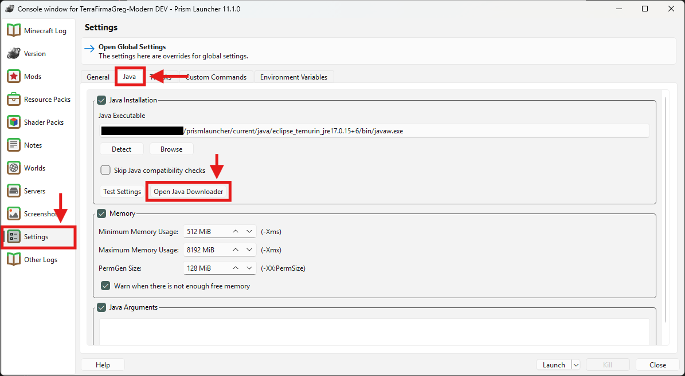
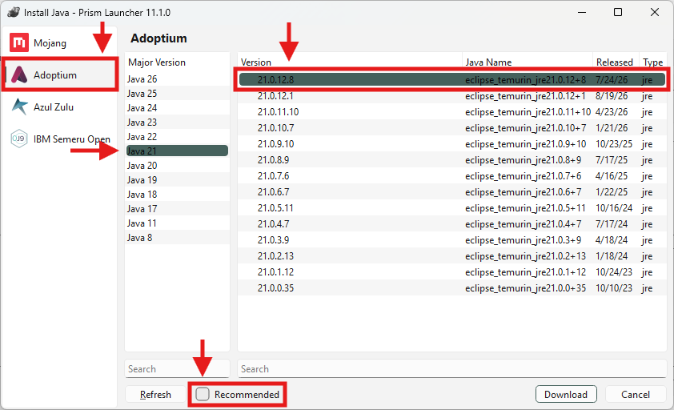
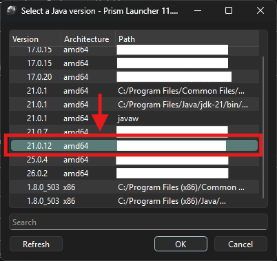

- [Why does my Java version matter and what's a "JVM"?](#why-does-my-java-version-matter-and-whats-a-jvm)
- [Which Java Distribution Should I Choose?](#which-java-distribution-should-i-choose)
- [Upgrading Java](#upgrading-java)
    - [Prism](#prism)
    - [CurseForge](#curseforge)

# Improving TFG Performance via Upgrading the JVM
game hitching every couple of seconds? crashing due to an "out of memory error" or "could not allocate"? unsatisfied with how much ram the the modpack uses? some of these problems can be ameliorated or eliminated (probably not the last one) by upgrading your java version!
## Why Does My Java Version Matter? And What's a "JVM"?
Great question! Your java version matters because of how Minecraft is compiled and ran on your computer. Java (the programming language) was designed to be "written once, ran anywhere" (WORA). This is why Minecraft, which is written in Java, can run on Linux, MacOS, and Windows. How does Java do this? Via the Java Virtual Machine, or JVM! In a nutshell, the JVM takes compiled Java bytecode and executes it...
- java version matters because each java version comes with jvm upgrades that could potentially improve performance
- primary performance improvement will come from garbage collector upgrades
- should explain what garbage collector is and why it's important
  - primary improvements with newer jvm are the addition of ZGC and generational garbage collection

- java 17 uses the G1 garbage collector by default, which is "mostly concurrent" which means that it performs most of its garbage collection in the background while the application is running, but still needs to occasionally occupy the main thread to free up space (which leads to hitching)
- [G1GC Technical Overview](https://www.oracle.com/java/technologies/javase/hotspot-garbage-collection.html)
- [ZGC Deep Dive](https://dl.acm.org/doi/full/10.1145/3538532)

- G1: aims for low pause times, but "low" is relative. for Minecraft, where any pause times greater than a hundredth of a second are noticeable and disruptive, G1 is no longer the best choice
  - Low pause times for small heaps, but large heaps lead to performance degradation due to needing more time to garbage collect
  - MC has very large heap, so G1 needs more time to collect, leading to long pauses -> hitching every so often

- ZGC: super low latency, does most of its garbage collection concurrently, only stops execution of application threads for < 10 ms when needed
  - there are some tradeoffs to using ZGC, but not ones relevant to MC

essentially upgrading your java version gives you access to better garbage collection which will generally reduce lag and frame hitching. Each new java version also comes with more technical improvements to the JVM, which will generally improve performance with zero downsides.

however, with each new java version comes the possibiltiy of breaking changes between versions. this almost definitely will not be an issue between java 17 and java 21, but the same cannot be said for newer versions like Java 26.

## Which Java Distribution Should I Choose?

## Upgrading Java
### Prism
1. Open your instance's Edit window and navigate to the Settings tab.
2. In the Settings Tab, click on the Java subtab.
3. In the "Java Installation" section, click on the "Open Java Downloader" button.

<figure>
  
  <figcaption>If you already have a newer java runtime installed, you can set it as your java executable here.</figcaption>
</figure>

4. At the bottom of the Install Java Wizard, uncheck the "Recommended" checkbox. This allows us to download Java versions that are not officially supported by our Minecraft install.
5. Click on **Adoptium** in the leftmost column, then **Java 21** in the Major Version column, then select the latest version of **Eclipse Temurin JRE 21**, which will be at the very top of the rightmost column. 

<figure>
  
  <figcaption>You're free to use any runtime you'd like, but this is what the TFG team recommends.</figcaption>
</figure>

6. Once the runtime is finished downloading, Prism will automatically close the Java Install Wizard and you will return back to your instance's Edit window. In "Java Installation", click the "Detect" button underneath the "Java Executable" text bar.
7. Select the java version you just downloaded. In my case, I downloaded **Java 21.0.12.8**, so I will select Version **21.0.12**. Click "OK".

<figure>
  
  <figcaption>You're free to use any runtime you'd like, but this is what the TFG team recommends.</figcaption>
</figure>

WIP
### CurseForge
WIP
